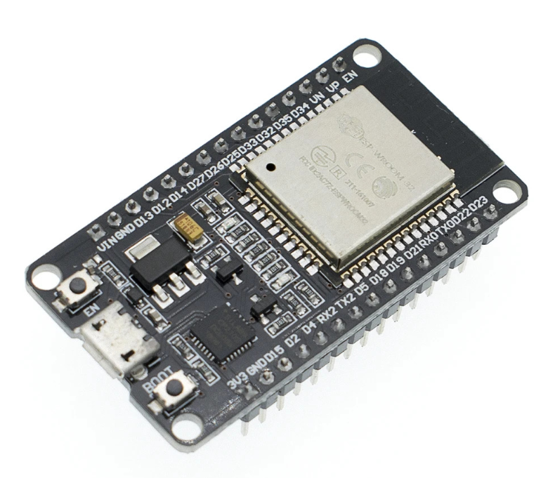
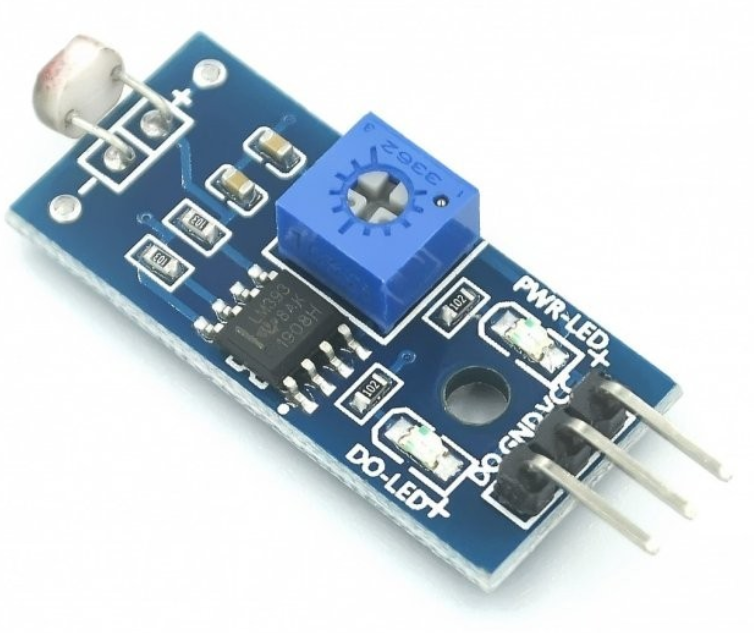
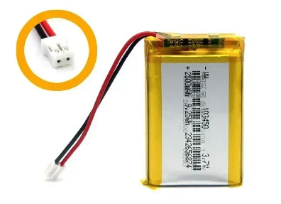
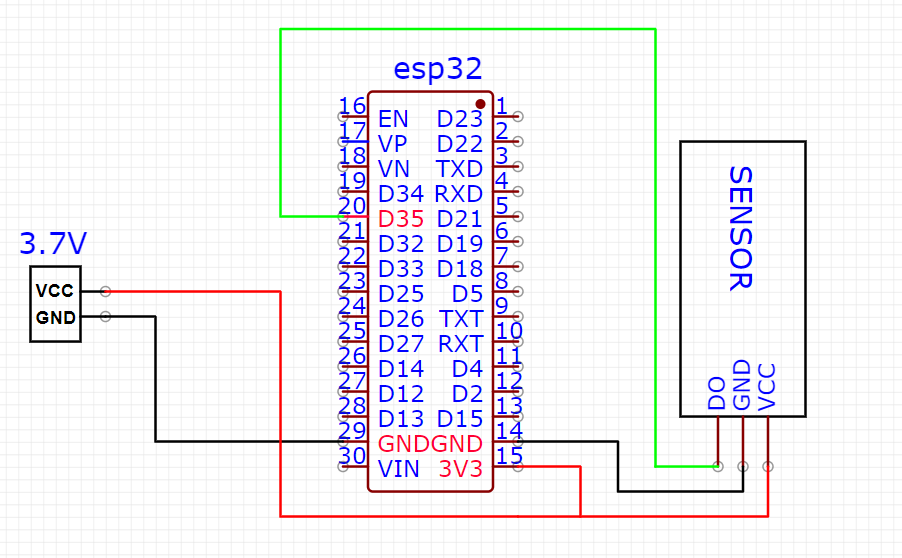
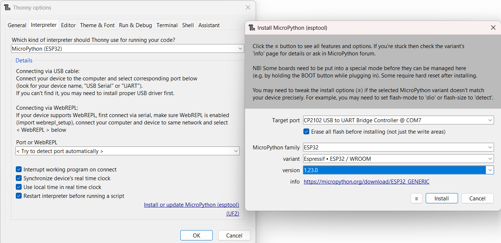
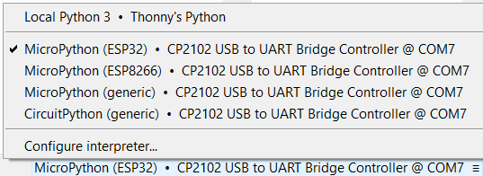
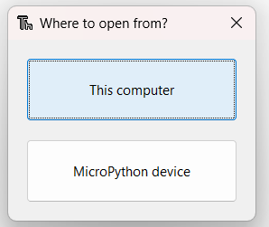

# ESP32 Light Notifier for Telegram
Writing Telegram bots in Python is very popular nowadays. However, there is always one problem - hosting. You either have to run the bot constantly, rent hosting, or provide power and network access to the microcontroller and forget about all these issues.

Python has several interpreters for microcontrollers, but the most popular one is MicroPython, which I will be using to write the bot.

* The only requirement for this project is a constantly connected Wi-Fi connection.

* Also you need to have ESP32 dev board https://alishort.com/TiTo2
* Light detection module. https://alishort.com/KiPKn
* 3.3-3.7 volts https://alishort.com/TiTo2
  
  

 

# Telegram

Create a new bot using BotFather.
Open Telegram and search for BotFather.
Start a conversation with BotFather by clicking the "Start" button.
To create a new bot, enter the command /newbot.
BotFather will ask for a name for your bot. Enter the name.
Then, BotFather will ask for a username for your bot. It must end in bot (e.g., my_test_bot).
After this, BotFather will provide you with a token for your bot. Save this token, as you will need it for setting up the bot.https://telegram.me/BotFather
* Save this token in config.py.
* Update your Email in config.py
* Create a new group. Add your bot to the group. Now everyone can join the group and receive notifications about disconnections or connections

# ESP32 flashing. 
ESP32 flashing: Upload firmware to the board using PyCharm with a plugin or Thonny. I choose Thonny since it's faster and easier. https://thonny.org/

* Open thonny 

* Tools -> Options -> Interpreter tab -> Micropython ESP32 -> Install or update Micropython -> pick and fill the same as on picture -> Click Install->Installed and flashed 100%

Make sure that you pick correct board in dropdown on the right below corner

File -> Open -> This computer -> upload config.py, main.py and utelegram.py.
If you click on MicroPython device you will see what uploaded in the board.

